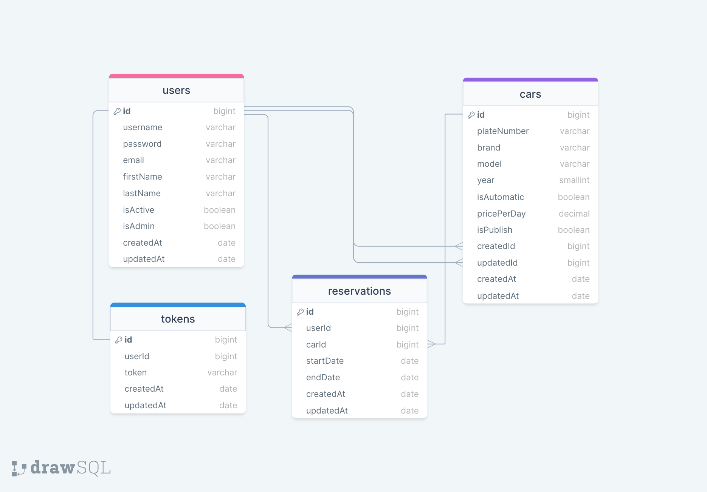

# RENT A CAR API

### ERD:



--- 

### Rent A Car Project 

- Customers;
  - can select start and end date and see the list of available cars on selected dates. It is not allowed to choose past dates.
  - can choose a car on the list and reserve that car, but can not reserve more than one car on a selected time period,
  - can not reserve cars which are reserved by other customers on selected time period.
  - can see the list of their reservations including past ones.
  - can list, create, read their reservations.
  - can not update, delete reservations.
  - get e-mails when they become member, rent a car, make a reservation etc.

- Admins;
  - can make CRUD operations on Car table,
  - can make CRUD operations on Customer (User) table,
  - can make CRUD operations on Reservation table,

- It can be createdId and updatedId in Car model.
- There will be searching, sorting and pagination capabilities on list views.


### Folder/File Structure:

```
    .env
    .gitignore
    index.js
    readme.md
    src/
        config/
            dbConnection.js
            swagger.json
        controllers/
            auth.js
            car.js
            reservation.js
            token.js
            user.js
        helpers/
            passwordEncrypt.js
            sync.js
        middlewares/
            authentication.js
            errorHandler.js
            findSearchSortPage.js
            logger.js
            permissions.js
        models/
            car.js
            reservation.js
            token.js
            user.js
        routes/
            auth.js
            car.js
            document.js
            index.js
            reservation.js
            token.js
            user.js
```# Rent-A-Car-Backend
